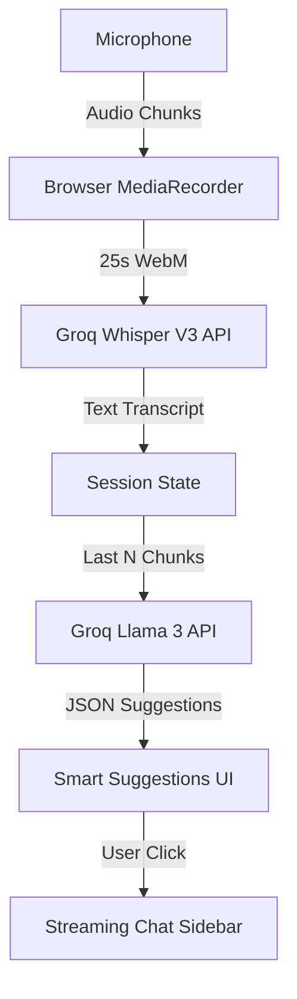

# TwinMind - Live Meetings AI Copilot

[](https://opensource.org/licenses/MIT)
[](https://reactjs.org/)
[](https://vitejs.dev/)
[](https://groq.com/)

TwinMind is a high-performance, real-time AI meeting assistant that listens to live conversations, provides instant transcriptions using **Groq Whisper Large V3**, and surfaces actionable insights and contextual suggestions using **Llama 3 / GPT-OSS 120B**.


## 🚀 Features

- **⚡ Real-Time Transcription**: Captured in 30s rolling chunks with high-accuracy Whisper V3 processing.
- **💡 Smart Suggestions**: 3 fresh, contextual suggestions generated every 30s to guide your meeting.
- **💬 Deep-Dive Chat**: Interactive sidebar to expand on suggestions or ask any follow-up questions.
- **🎨 Premium UI**: Modern glassmorphism design with responsive 3-column layout.
- **🔒 Privacy First**: Direct browser-to-API communication; no meeting data is stored on any intermediary server.
- **📥 Session Export**: Download your entire meeting history (transcript, suggestions, chat) as a structured JSON file.

## 🛠️ How it Works



## 📦 Installation & Setup

### Prerequisites
- Node.js (v18+)
- A [Groq API Key](https://console.groq.com/keys)

### Setup
1. **Clone the repository**:
   ```bash
   git clone https://github.com/HardikTi13/twinassign.git
   cd twinassign
   ```

2. **Install dependencies**:
   ```bash
   npm install
   ```

3. **Run the development server**:
   ```bash
   npm run dev
   ```

4. **Configuration**:
   - Open the app in your browser (usually `http://localhost:5173`).
   - Click the **Settings (Gear Icon)** in the top right.
   - Enter your **Groq API Key** and Save.

## 🛡️ License

This project is licensed under the MIT License - see the [LICENSE](LICENSE) file for details.

## 👥 Author

- **Hardik Tiwari** - [GitHub](https://github.com/HardikTi13)

---
*Built with passion for the Groq hackathon/assignment.*
